# ***JustAsk Blog - Project Portfolio 4***
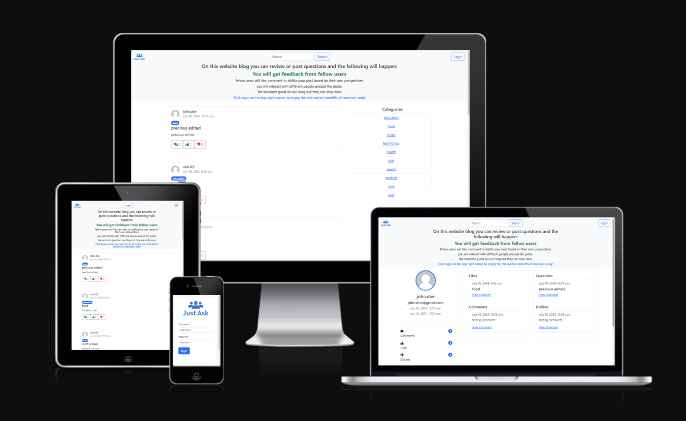
# **1. Key project information**

- **Description :** **Just ask** is a question-and-answer website where users can ask questions, answer questions, and interact with other users.
- **Key project goal :** To familiarize visitors of this page with **justask** blog
- **Audience :** Target audience are users that are using search engines to ask quetions and those who are looking for answers from various topics
- **Live version :** Live version of **Just Ask** page can be viewed at [JustAsk](https://just-ask-b3c36fe12bcc.herokuapp.com/).

## Table of Contents
+ [UX](#ux "UX")
+ [Design](#design "Design")

+ [Features](#features "Features")
  + [The Idea](#the-idea "The Idea")
  + [Epics](#epics "Epics")
  + [User stories](#user-stories "User stories")
  + [Surface Plane](#surface-plane "Surface Plane")
  + [Used Elements](#used-elements "Used Elements")
+ [Testing](#testing "Testing")
  + [Validator Testing](#validator-testing "Validator Testing")
  + [Manual Testing](#manual-testing "Manual Testing")
  + [Bugs](#bugs "Bugs")
  + [Remaining Bugs](#remaining-bugs "Remaining bugs")
  + [Error Pages](#error-pages "Error Pages")
+ [Technologies Used](#technologies-used "Technologies Used")
  + [Main Language](#main-language "Main Language")
  + [Frameworks, Libraries & Programs](#frameworks-libraries-programs "Frameworks, Libraries & Programs")
+ [Deployment](#deployment "Deployment")
  + [Deployment on GitHub Pages](#deployment-on-github-pages)
  + [Cloning the Repository](#cloning-the-repository)
  + [Forking the Repository](#forking-the-repository)
  + [Deploying on Heroku](#deploying-on-heroku)
  + [Settings.py & File-Tree Configuration](#settingspy--file-tree-configuration)
  + [Running the Application](#running-the-application)
  + [Page Deployment](#page-deployment)
+ [Credits](#credits "Credits")

+ [Acknowledgements](#acknowledgements "Acknowledgements")

## UX

## Project Management

### Kanban Board & User Stories
I've been using the application ``Kanban Board`` and the project board in GitHub to keep my project together. It has been working really well and has helped me structure up my work a lot. Trello was used on a more general plan and GitHub was used to plan and organize my user stories.

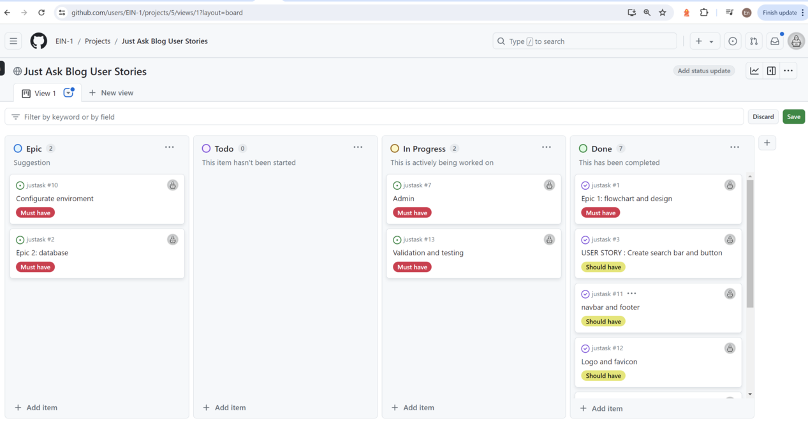


[Back to top](<#table-of-content>)

### Database Schema
application [draw.io](docs/dbase/schema.db.png).

Models used (besides standard user model) in this project are:

* **Category** - Handles categories. I made a specific model to be able to add more dynamics (create / remove categories going forward in the admin backend instead of 'hard code' it in the code).
* **Genre** - Handles genres. I made a specific model to be able to add more dynamics (create / remove genres going forward in the admin backend instead of 'hard code' it in the code).
* **Post** - Handles all the reviews
* **Comment** - Handles all the comments
* **UserProfile** - Handles the user profile information (first name, last name, presentation and featured image for the specific user/reviewer). There is a one-to-one relation to the user model to connect it to the standard user model.

### Design


[Back to top](<#table-of-contents>)

## Features

### Existing Features:

[Back to top](https://github.com/Blog#1key-project-information)

### The Idea

**Just ask** Blog website is a question-and-answer website where users can ask questions, answer questions, and interact with other users by liking or dislinking comments. It covers a wide range of topics from technology and business to health and entertainment. Users can follow topics, answer questions based on their expertise, and engage in discussions with a community of users. Just Ask's objective is to connect people with information and allow them to share knowledge and learn from each other.
### The Ideal User
The target audience is anyone curouis of the outside world and is interested to interact with other people.

- User can `like` or `dislike`on posts
- User can comment
- User can `delete` or `edit` his/her posts

### Site Goals

- Share knowledge and experiences with the globle communty and to offer mutual support to one another.

### Epics

As a thought process of the strategy plane, 9 epics were created and utilized. Please see below the detail list of epics with links, or a link to the project's [Kanban Board](https://github.com/users/EIN-1/projects/5). Those Epics were further sliced into USER STORIES.


- [Epic 1: Environment Configuration](https://github.com/users/EIN-1/projects/5/views/1?pane=issue&itemId=70745632)
- [Epic 2: Database Models](https://github.com/users/EIN-1/projects/5/views/1?pane=issue&itemId=70745621)
- [Epic : Admin Panel](https://github.com/users/EIN-1/projects/5/views/1?pane=issue&itemId=70745627)
- [Epic 4: Post Views and likes](https://github.com/users/EIN-1/projects/5/views/1?pane=issue&itemId=70745630)
- [Epic 5: User Authentication](https://github.com/users/EIN-1/projects/5/views/1?pane=issue&itemId=70745637)
- [Epic 6: flowchart and design](https://github.com/users/EIN-1/projects/5/views/1?pane=issue&itemId=70745620)
- [Epic 7: Create search bar and button](https://github.com/users/EIN-1/projects/5/views/1?pane=issue&itemId=70745624)
- [Epic 9: Testing and Validation](https://github.com/users/EIN-1/projects/5/views/1?pane=issue&itemId=70745636)

### User stories

User stories were created based on the Epics. Each user story uses the MoSCoW prioritization technique. Each user story on the [Kanban Board](https://github.com/users/EIN-1/projects/5/views/1) was given (MoSCoW) labels.

### MoSCoW
#### MoSCoW prioritization technique stands for:

**Must-Have**: Critical requirements that must be implemented for the project to be considered successful.

**Should-Have**: Important requirements that are not critical but add significant value.

**Could-Haves**: Desirable features that would be nice to have but are not crucial.

**Won't-Have**: Features that are explicitly excluded from the project scope.

[Back to top](<#table-of-contents>)

## Surface Plane

 ### Color pallette
- I used primary, success, light, dark for my webpage as they are the defaults of bootstrap.

  + dark = black
  + primary = blue
  + success = green
  + light = smoke white

## Used Elements

  ### Landing Page
  
  - The banner explains what the website blog do and how to manover!
  - **Template File :** `home.html` - extends `base.html`
  - Contains list of posts.
  - Provides user with all Posts published along with name of creator, date created and a snippet of Post body. Also number of votes and comments is provided to both logged in and not logged in users.

  ### Header
  

  - It is fully responsive and includes the just ask blog name on the left and member links and blog slogan on the right.

  - The blog name is wrapped in a link and can be used to navigate to the homepage.

  - After logging in, the links on the right side are replaced by the Read Later and a log-out button.

  ### Footer
  

  - Every page has a footer at the bottom of the page.
  - The footer shows the copyright text and links to four different social media websites. Each link opens in a new tab.

[Back to top](<#table-of-contents>)

  ### Login

- Every template in this project is equipped with Favicon. This is to ease navigation for user in case of more tabs opened. 
  ### Register
  
  - Every template in this project is equipped with Favicon. This is to ease navigation for user in case of more tabs opened. 
  ### Reset password
  
 - Every template in this project is equipped with Favicon. This is to ease navigation for user in case of more tabs opened. 

[Back to top](<#table-of-contents>)

 ### Profile
 
 - User profile one can see all the reactions done by a user.. 
 
 [Back to top](<#table-of-contents>)
 ### Search
 
 - The search button is in the middle of the search bar, here you can search anything you like. 
 ### Highlight post
 
 - When you are in user profile and click view question like it takes you directly to the question and it highlights it like this.
 
 [Back to top](<#table-of-contents>)

 ### Categories
 
 - You can click on a category and see all the questions in it or chose a category that you might want to talk about.
 ### Super user Admin
 
 - Super user Admin can delete, edit and add all elements on the app.
 [Back to top](<#table-of-contents>)

  ### Admin can do alot of things, below are a few of them.

- Admin can add comment to user of choice

- Admin  can change question to user of choice

- Admin can view all the user

[Back to top](<#table-of-contents>)


### Forms

- **App :** `AllAuth` extension
- **Template File :** `*.html` in `./templates/account` - extends `base.html`
- **User :** Forms do interact with user. They are designed to be clear and to the point, always in center of the screen. 

#### Forms authenticators
- all felds on a form must be filled 
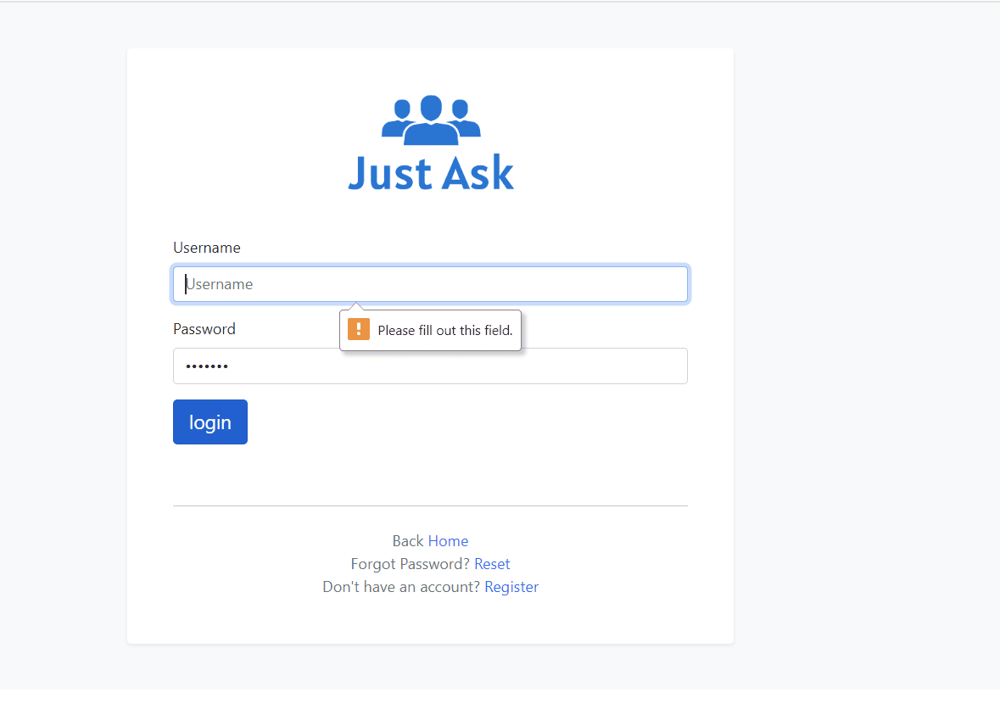
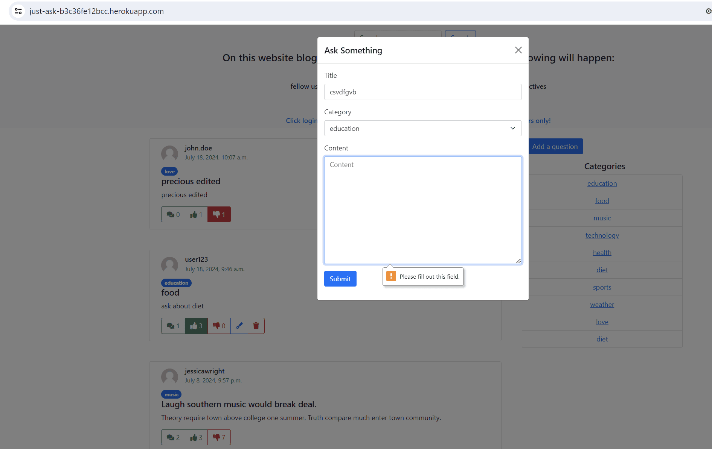

[Back to top](<#table-of-contents>)

#### User feedback
 - after an action reation the user gets a feedback


[Back to top](<#table-of-contents>)

#### Admin feedback and authentication
 - after an action reation the Admin gets a feedback and authentication
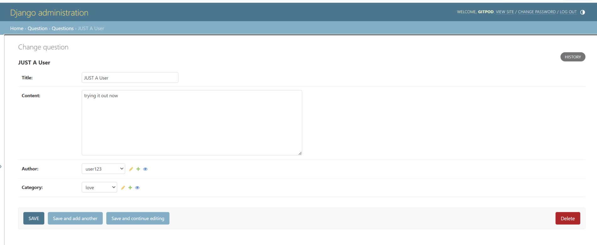
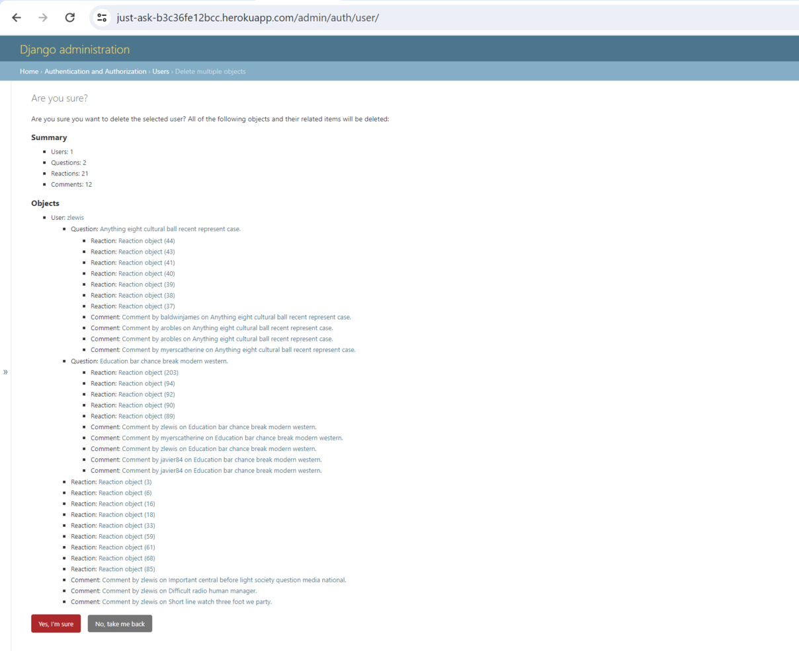

[Back to top](<#table-of-contents>)

### Responsiveness Test
The responsive design tests were carried out manually with [Google Chrome DevTools](https://developer.chrome.com/docs/devtools/) and [Responsive Design](https://ui.dev/amiresponsive).

| Desktop    | Display > 1280px      | Display < 1280px   |
|------------|-----------------------|--------------------|
| Render     | pass                  | pass               |
| Links      | pass                  | pass               |
| Images     | pass                  | pass               |

| Tablet     | Samsung Galaxy Tab 10 | Amazon Kindle Fire | iPad Mini | iPad Pro |
|------------|-----------------------|--------------------|-----------|----------|
| Render     | pass                  | pass               | pass      | pass     |
| Links      | pass                  | pass               | pass      | pass     |
| Images     | pass                  | pass               | pass      | pass     |

| Phone      |Galaxy S5/S6/S7/S20+   | iPhone 6/7/8/ plus | iPhone 14pro max     |
|------------|-----------------------|--------------------|----------------------|
| Render     | pass                  | pass               | pass      | pass     |
| Links      | pass                  | pass               | pass      | pass     |
| Images     | pass                  | pass               | pass      | pass     |

[Back to top](<#table-of-contents>)

### Browser Compatibility
`justask` blog was tested for functionality and appearance in the following browsers on desktop. No visible or funcional issues on all 
the browsers below.

- Google Chrome - Version 121.0.6422.114 (Official Build) (64-bit)
- Microsoft Edge - Version 124.0.2478.80 (Official build) (64-bit)
- Mozilla Firefox - 127.0 (64-bit)

[Back to top](<#table-of-content>)


## Technologies Used
### Main Language
- Python Language

### Frameworks, Libraries & Programs

- [**AmIResponsive**](https://ui.dev/amiresponsive) - the responsive preview image on different gadgets.
- [**iloveimg**](https://www.iloveimg.com/) - to compress the images.
- [**Google Fonts**](https://fonts.google.com/) site was used to pick the best typography style. The most importance was given to balance between style and readability. As a developer I needed to ensure that all text is displayed clear.
- [**Schemas**](https://app.diagrams.net/) - to create database structure.

- [**Django/Jinja**](https://docs.djangoproject.com/en/5.0/) - main Framework of the project
- [**Python**](https://www.python.org/) - main BackEnd programming language of the project
- [**HTML**](https://developer.mozilla.org/en-US/docs/Web/HTML) - templates programming language of this project (FrontEnd)
- [**CSS**](https://developer.mozilla.org/en-US/docs/Web/CSS) - styling the project via external CSS file `./static/css/style.css`
- [**Java Script**](https://developer.mozilla.org/en-US/docs/Web/JavaScript) - dynamic templates programming language of this project (FrontEnd)
- [**jQuery**](https://api.jquery.com/) - API for JavaScript - dynamic templates programming language of this project (FrontEnd)
- [**Bootstrap v. 5.**](https://getbootstrap.com/) - styling framework used in this project (FrontEnd)
- [**Gitpod**](https://gitpod.com/) - online IDE - gitpod was used to create this project
- [**Git**](https://git-scm.com/doc) - to make commitments of progress and push the results back to GitHub
- [**GitHub**](https://github.com/) - to keep the track of version control
- [**Heroku**](https://heroku.com) - to deploy this project
- [**Google Fonts**](https://fonts.google.com/) - used for picking the best typography
- [**PostgresSQL**](https://www.postgressql.com/) - used as a database storage
- [**Cloudinary**](https://console.cloudinary.com/) - used as a storage of static files
- [**FavIcon.io**](https://favicon.io/favicon-converter/) - used to compress favicon
- [**W3Schools**](https://www.w3schools.com/) - useful information and cheat sheets
- [**Google Fonts**](https://fonts.google.com/) site was used to pick the best typography style. The most importance was given to balance between style and readability. As a developer I needed to ensure that all text is displayed clear.

[Back to top](<#table-of-contents>)

# Testing

## Validator Testing

[html validator](docs/testing/html-validator.png)
- The 3 errors could be fixed by changes the id names in each form but my time runout so i plan to fix the future.

[css validator](docs/testing/css.Validator.png)
- The warming are coming from the Django librarries, I was looking through them but they are almost the same dublicated warnings, I look forward in digging more into them when I have more time.

[Back to top](<#table-of-contents>)

## Manual Testing
- I used lighthouse testing and these are the results for desktop 
   

- I used lighthouse testing and these are the results for mobile devices
    

- Tested for responsiveness manually and it was responding well.

[Back to top](<#table-of-contents>)

# new new
# 🧪 Testing

## ✅ Validator Testing

### **HTML Validator**  
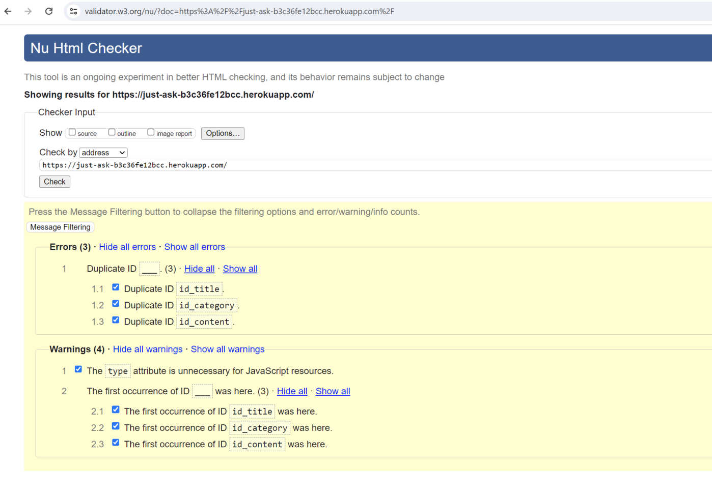  
- There are **3 errors** that could be fixed by changing the **ID names** in each form.  
- Due to time constraints, I plan to fix these issues in the future.

### **CSS Validator**  
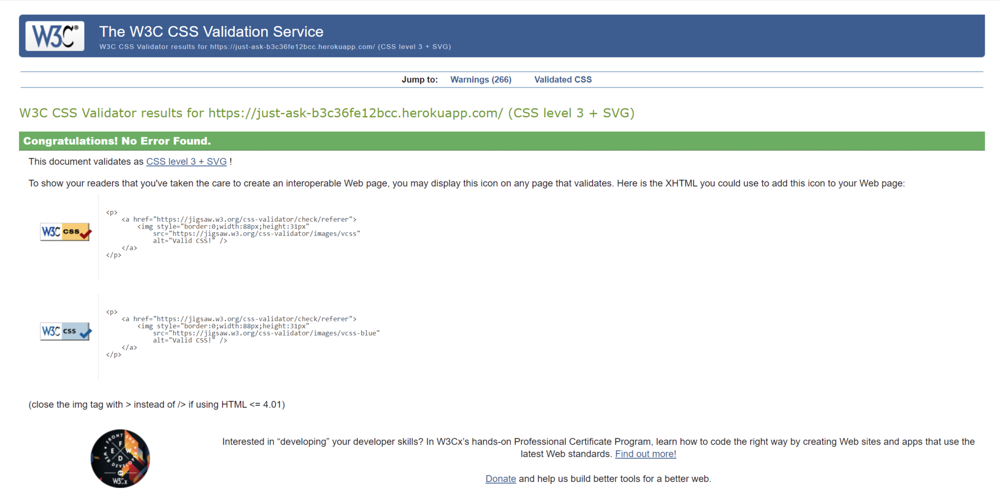  
- The **warnings** originate from Django libraries.  
- Many of these warnings are duplicated, and I plan to explore solutions when more time is available.

### **JSHint Testing**  
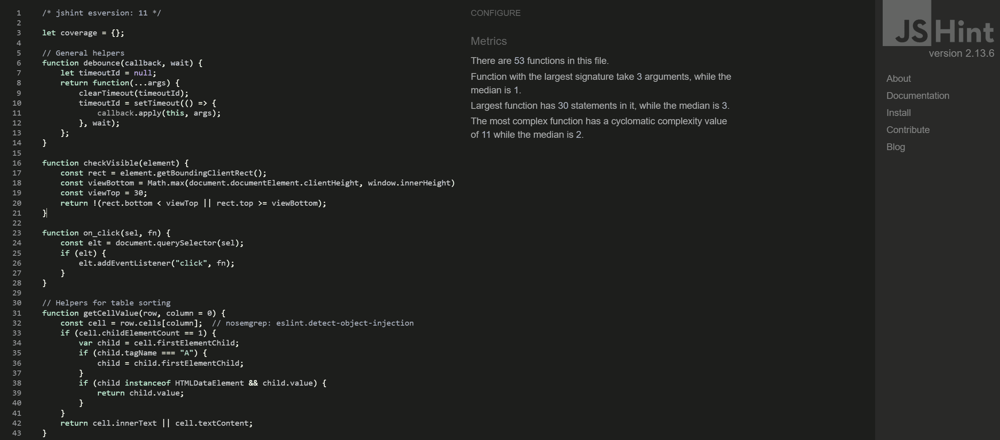  
- **Version:** 2.13.6  
- **About:** Static code analysis tool for JavaScript.  

#### 🔧 **Configure Metrics**

- There are **53 functions** in this file.
- The **largest function** takes **3 arguments**, while the **median** is **1**.
- The **largest function** has **30 statements**, while the **median** is **3**.
- The **most complex function** has a **cyclomatic complexity** of **11**, while the **median** is **2**.


[🔝 Back to top](#table-of-contents)

---

## 🛠️ Manual Testing

- **Lighthouse Testing (Desktop):**  
  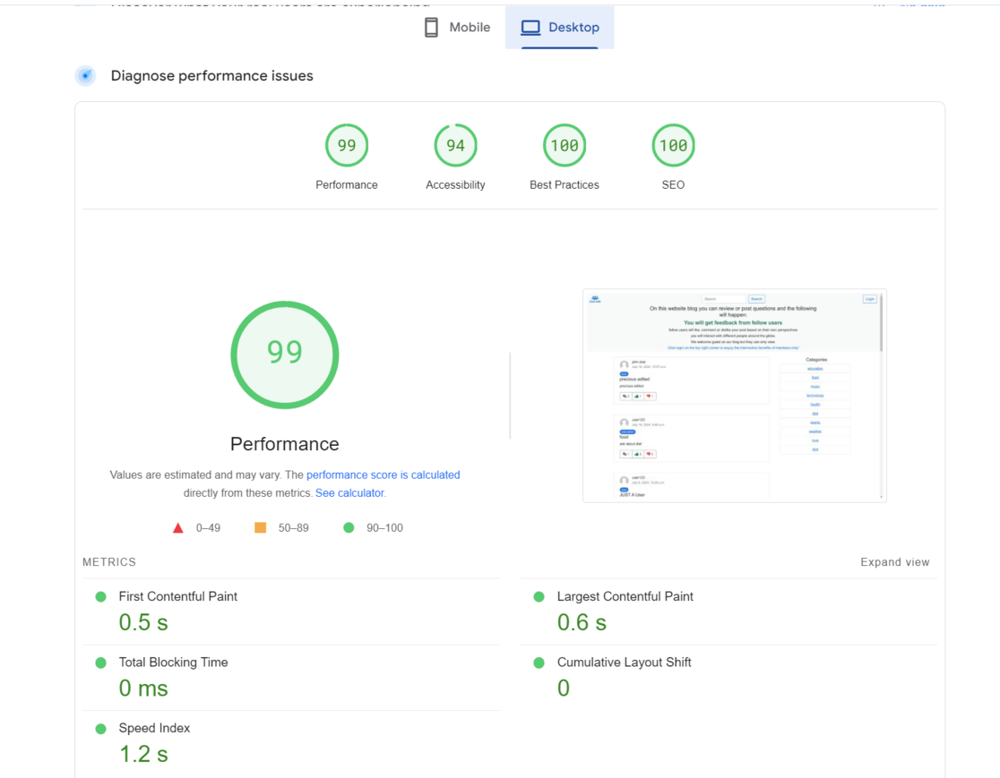

- **Lighthouse Testing (Mobile):**  
  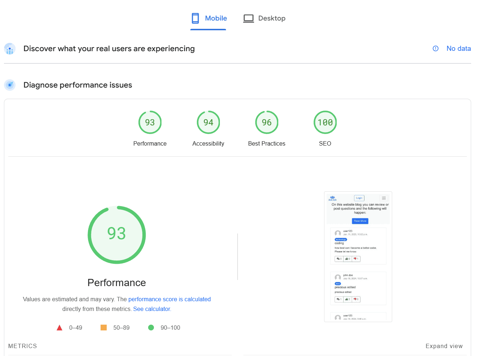

- **Responsiveness:**  
  - Manually tested across devices.  
  - The website responds well on various screen sizes.

[🔝 Back to top](#table-of-contents)

---

## 🤖 Automatic Testing

### **Test Execution**

Command used to run the Django test suite:

```bash
DATABASE_URL=sqlite:///db.sqlite3 python manage.py test
```

**Output:**

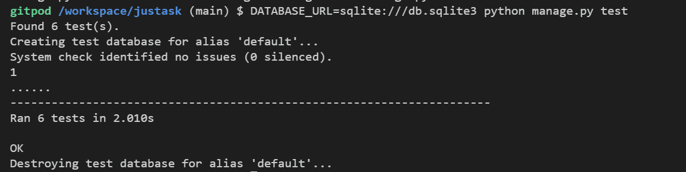

[🔝 Back to top](#table-of-contents)


Command used to run the Django test suite with coverage:

```bash
DATABASE_URL=sqlite:///db.sqlite3 coverage run manage.py test
```

**Output:**

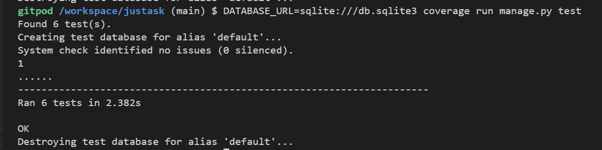

[🔝 Back to top](#table-of-contents)

### 📊 **Coverage Report**

Command used to generate the coverage report:

```bash
coverage report
```

**Results:**

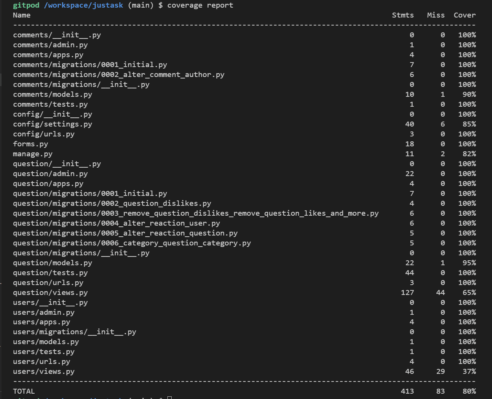

[🔝 Back to top](#table-of-contents)

 ---

## Bugs
- wrong count in likes, dislikes and comments but got fixed

- [**Stackoverflow Django annotate() multiple times causes wrong answers**] (https://stackoverflow.com/questions/1265190/django-annotate-multiple-times-causes-wrong-answers) - It helped in fixing bug with likes and dislikes showing wrong counts by adding distinct=True in my multiple annotation in the home view see below

### Remaining Bugs
- No bugs remaining as far as I know.

[Back to top](<#table-of-contents>)

 ### Error Pages

 - This project is designed to have custom error pages. In case of user clicks on broken link, submits action that isn't supported or tries to reach certain view without permission, then user isn't completely "cut off" from browsing, instead an error page with header and footer appears and user is informed of the situation.

 The following custom error pages were created :

 
 - 404 - Encountered when the requested web resource by user is not found on the server. 
  
 - 500 - Displayed when the web server encounters an internal error while processing the reques then it sends you a warning.

[Back to top](<#table-of-contents>)

# Deployment
## Deployment on GitHub Pages

### Steps:
1. Navigate to the **Settings** tab in your GitHub repository.  
2. Click on **Pages** from the left-hand menu.  
3. In the **Branch** section, select the **Main** branch from the drop-down menu.  
4. Once selected, the page will refresh, and a success ribbon will appear indicating successful deployment.  
5. Any changes pushed to the **master/main** branch will automatically update the live project: 👉 [Just ASK](https://just-ask-b3c36fe12bcc.herokuapp.com/)  


[Back to top](#table-of-contents)

---

## Cloning the Repository

### Steps:
1. Visit the [GitHub Repository](https://github.com/EIN-1/justask).  
2. Click the **Code** button and select **HTTPS**, then copy the link.  
3. Open **Git Bash** and navigate to your desired directory.  
4. Run the following command:
   ```bash
   git clone <paste-copied-URL>
   ```


[Back to top](#table-of-contents)

---

## Forking the Repository

### Steps:
1. Log in to **GitHub**.
2. Locate the repository you want to fork.
3. On the **top-right side** of the page, click the **Fork** button to create a copy of the repository.


[Back to top](#table-of-contents)

---

## Deploying on Heroku

### Prerequisites
Ensure `requirements.txt` has all dependencies:

```bash
pip3 freeze > requirements.txt
```

### Steps:
1. Log in or sign up for a [Heroku](https://www.heroku.com/) account.
2. Open the **Dashboard**.
3. Click **New** → **Create new app**.
4. Enter a **unique app name** and select your **region**.
5. Click **Create App**.


[Back to top](#table-of-contents)

---

## Settings.py & File-Tree Configuration

### Steps:
1. **Create `env.py`:** Store all sensitive information.
2. **Ignore Sensitive Files:** Add `env.py` to `.gitignore` to prevent exposure.
3. **Update `settings.py`:**
   - Import OS:
     ```python
     import os
     ```
   - Configure the database:
     ```python
     if "DATABASE_URL" in os.environ:
         DATABASES = {"default": dj_database_url.parse(os.environ.get("DATABASE_URL"))}
     else:
         DATABASES = {
             "default": {
                 "ENGINE": "django.db.backends.sqlite3",
                 "NAME": os.path.join(BASE_DIR, "db.sqlite3"),
             }
         }
     ```
   - Configure static and media files:
     ```python
     STATIC_URL = "/static/"
     STATICFILES_STORAGE = "cloudinary_storage.storage.StaticHashedCloudinaryStorage"
     STATICFILES_DIRS = [os.path.join(BASE_DIR, "static")]
     STATIC_ROOT = os.path.join(BASE_DIR, "staticfiles")
     CLOUDINARY_URL = os.environ.get("CLOUDINARY_URL")
     MEDIA_URL = "/media/"
     DEFAULT_FILE_STORAGE = "cloudinary_storage.storage.MediaCloudinaryStorage"
     ```
   - Configure email settings:
     ```python
     EMAIL_HOST = "smtp.gmail.com"
     EMAIL_PORT = 587
     EMAIL_HOST_USER = os.environ.get("EMAIL_HOST_USER")
     EMAIL_HOST_PASSWORD = os.environ.get("EMAIL_HOST_PASSWORD")
     EMAIL_USE_TLS = True
     ```
4. **Run Database Migrations:**
   ```bash
   python manage.py migrate
   ```
5. **Create `static` and `templates` Directories**
6. **Commit and Push Changes to GitHub**

[Back to top](#table-of-contents)

---

## Running the Application

### Set Environment Variables in Development:
```bash
export DEBUG=True
export SECRET_KEY='random_string'
export DATABASE_URL='your_postgres_database_url'
```

### Run the Server:
```bash
python manage.py runserver
```

[Back to top](#table-of-contents)

---

## Page Deployment

### Steps:
1. Log in and click **Create new** on the dashboard.
2. Name the app and select a region. Click **Create App**.
3. Add two buildpacks in the **Settings** tab:
   - heroku/python
   - heroku/nodejs
4. Add **Config Vars**:
   - `KEY`: `PORT` → `VALUE`: `8000`
5. Connect GitHub and deploy:
   - **Manual Deploy** for manual updates.
   - **Automatic Deploy** for auto-updates.

🔗 **Live Deployment:** [Just ASK](https://just-ask-b3c36fe12bcc.herokuapp.com/)

[Back to top](#table-of-contents)


---

### Credits

- [**The Django admin site**](https://docs.djangoproject.com/en/5.0/ref/contrib/admin/) - How to set up my Superuser Admin.
- [**jQuery.post()**](https://api.jquery.com/jQuery.post/)
- [**Django documentation template comments**](https://docs.djangoproject.com/en/5.0/ref/templates/language/#comments) - Setting up my comments template 
- [**django-gravatar**](https://github.com/twaddington/django-gravatar) - How to use gravatar icons on my blog.
- [**Geeksforgeeks Django Jinja**](https://www.geeksforgeeks.org/jinja-for-server-side-rendering-in-django/) - How to work with jinja.
- [**Django Templates**](https://docs.djangoproject.com/fr/4.2/topics/templates/) - How to work with templates.
- [**Django documentation Model.__str__**](https://docs.djangoproject.com/en/5.0/ref/models/instances/) - How to work with model string.
- [**Stackoverflow How to set up Django website with jQuery**](https://stackoverflow.com/questions/12031825/how-to-set-up-django-website-with-jquery)
- [**color testing**](https://color.a11y.com/Contrast/) - Checked my website color contex
- [**Password validation**](https://docs.djangoproject.com/en/5.0/ref/settings/#auth-password-validators) - with Django
- [**time zone**](https://docs.djangoproject.com/en/5.0/topics/i18n/) - Internationalization
- [**user authentication and management**](https://youtu.be/WuyKxdLcw3w?si=a_-3HyADtu5sblOR) - user authentication and management
- [**Ajax forn submission**](https://youtu.be/KgnPSmrQrXI?si=Y1Whk2AATEYZB1Dz) - Ajax forn submission


[Back to top](<#table-of-contents>)

 ## Acknowledgments
 The application `Just Ask` was completed as the Portfolio Project 4 for the Full Stack Software Development Diploma at the [Code Institute](https://codeinstitute.net/).
  - A special thanks to my cohort facilitator `Ms. Kay Welfare` for her advice and support her quick feedback was very helpful and encouraging.
  - I would like to thank my mentor` Mr. Precious Ijege` for relevant feedback during the project.
  
 - **Developer :** [Elsie Nagawa ](https://github.com/EIN-1/justask)
 22.07.2024.

 [Back to top](<#table-of-contents>)