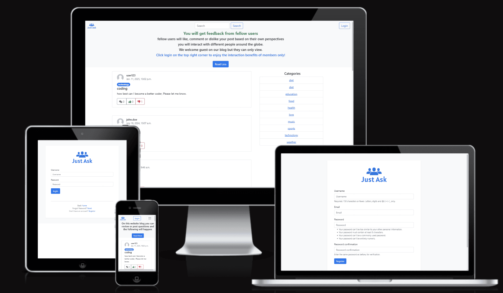
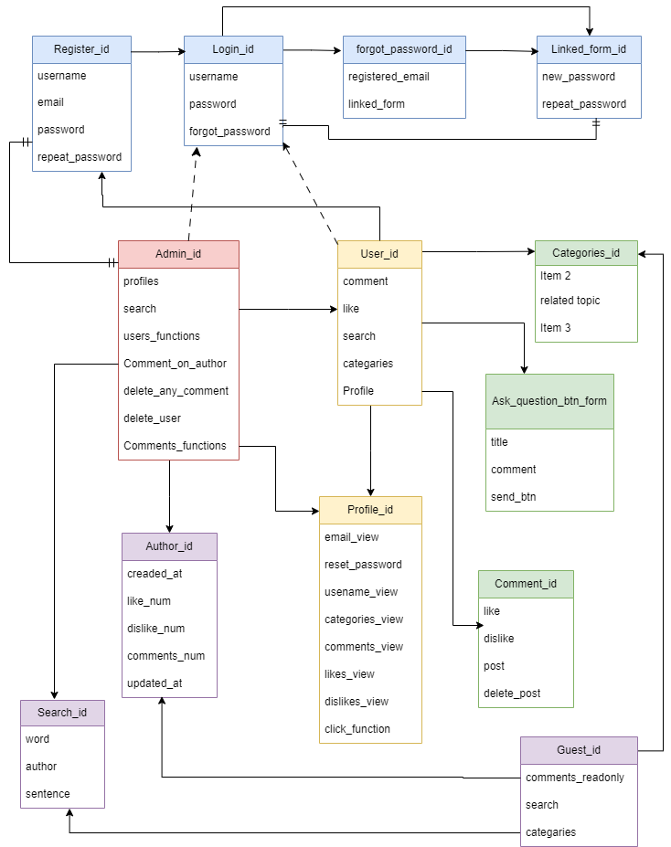
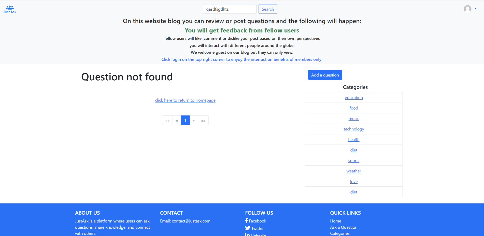
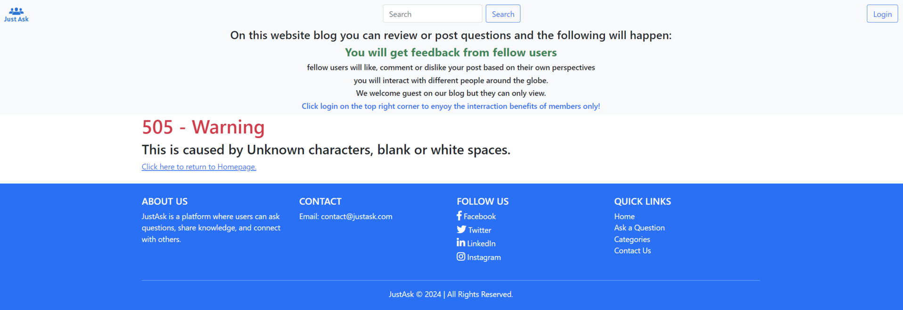

# ***JustAsk Blog - Project Portfolio 4***


# **1. Key project information**

- **Description :** **Just ask** is a question-and-answer website where users can ask questions, answer questions, and interact with other users.
- **Key project goal :** To familiarize visitors of this page with **justask** blog
- **Audience :** Target audience are users that are using search engines to ask quetions and those who are looking for answers from various topics
- **Live version :** Live version of **Just Ask** page can be viewed at [JustAsk](https://just-ask-b3c36fe12bcc.herokuapp.com/).

# Table of Contents

+ [UX](#ux)
  + [User Stories](#user-stories)
  + [Project Management](#project-management)
  + [Database Schema](#database-schema)
  + [Design](#design)
+ [Features](#features)
  + [Existing Features](#existing-features)
  + [The Idea](#the-idea)
  + [The Ideal User](#the-ideal-user)
+ [Testing](#testing)
  + [Automatic Testing](#automatic-testing)
    + [Test Execution](#test-execution)
    + [Coverage Report](#coverage-report)
  + [Validator Testing](#validator-testing)
    + [HTML Validator](#html-validator)
    + [CSS Validator](#css-validator)
    + [JSHint Testing](#jshint-testing)
  + [Manual Testing](#manual-testing)
    + [Responsiveness Test](#responsiveness-test)
    + [Browser Compatibility](#browser-compatibility)
  + [Bugs](#bugs)
    + [Fixed Bugs](#fixed-bugs)
    + [Remaining Bugs](#remaining-bugs)
  + [Error Pages](#error-pages)
  + [User Stories](#user-stories)
  + [Comprehensive Functional Testing](#comprehensive-functional-testing)
    + [Navigation Bar](#navigation-bar)
    + [Question Submission Form](#question-submission-form)
    + [Login Form](#login-form)
    + [Registration Form](#registration-form)
    + [Search Bar](#search-bar)
    + [Read More/Less Button](#read-moreless-button)
    + [Like and Dislike Button](#like-and-dislike-button)
    + [Comment Button](#comment-button)
    + [Responsiveness](#responsiveness)

[Back to top](#table-of-contents)

---
# UX
## User Stories
### For Users

* As a **USER** I want to **REGISTER AND LOG IN** so that I can **INTERACT WITH CONTENT ON THE PLATFORM**.

* As a **USER** I want to **ASK QUESTIONS** so that I can **RECEIVE ANSWERS FROM THE COMMUNITY**.

* As a **USER** I want to **EDIT OR DELETE MY OWN QUESTIONS** so that I can **MANAGE MY CONTENT**.

* As a **USER** I want to **COMMENT ON QUESTIONS** so that I can **CONTRIBUTE TO DISCUSSIONS**.

* As a **USER** I want to **DELETE MY OWN COMMENTS** so that I can **MANAGE WHAT I SHARE**.

* As a **USER** I want to **LIKE OR DISLIKE POSTS** so that I can **EXPRESS MY OPINION**.

* As a **USER** I want to **SEARCH FOR QUESTIONS** so that I can **FIND TOPICS OF INTEREST**.

### For Admins

* As an **ADMIN** I want to **MANAGE USER CONTENT** so that I can **MAINTAIN THE QUALITY OF POSTS**.

* As an **ADMIN** I want to **APPROVE OR REMOVE INAPPROPRIATE CONTENT** so that the **PLATFORM REMAINS SAFE**.

* As an **ADMIN** I want to **MANAGE USER ACCOUNTS** so that I can **CONTROL PLATFORM ACCESS**.

* As an **ADMIN** I want to **MONITOR PLATFORM PERFORMANCE** so that I can **IMPROVE THE USER EXPERIENCE**.

[Back to top](#table-of-contents)

## Project Management
### Kanban Board

I've been using the application ``Kanban Board`` and the project board in GitHub to keep my project together. It has been working really well and has helped me structure up my work a lot. Trello was used on a more general plan and GitHub was used to plan and organize my user stories.

[Back to top](<#table-of-content>)

### Epics

As a thought process of the strategy plane, 9 epics were created and utilized. Please see below the detail list of epics with links, or a link to the project's [Kanban Board](https://github.com/users/EIN-1/projects/5). Those Epics were further sliced into USER STORIES.


- [Epic 1: Environment Configuration](https://github.com/users/EIN-1/projects/5/views/1?pane=issue&itemId=70745632)
- [Epic 2: Database Models](https://github.com/users/EIN-1/projects/5/views/1?pane=issue&itemId=70745621)
- [Epic : Admin Panel](https://github.com/users/EIN-1/projects/5/views/1?pane=issue&itemId=70745627)
- [Epic 4: Post Views and likes](https://github.com/users/EIN-1/projects/5/views/1?pane=issue&itemId=70745630)
- [Epic 5: User Authentication](https://github.com/users/EIN-1/projects/5/views/1?pane=issue&itemId=70745637)
- [Epic 6: flowchart and design](https://github.com/users/EIN-1/projects/5/views/1?pane=issue&itemId=70745620)
- [Epic 7: Create search bar and button](https://github.com/users/EIN-1/projects/5/views/1?pane=issue&itemId=70745624)
- [Epic 9: Testing and Validation](https://github.com/users/EIN-1/projects/5/views/1?pane=issue&itemId=70745636)

[Back to top](<#table-of-contents>)

## MoSCoW prioritization :

- **Must-Have**: Critical requirements for project success.
- **Should-Have**: Important but not critical features.
- **Could-Haves**:Desirable but non-essential features.
- **Won't-Have**: Features explicitly excluded from the project scope.

## Database Schema

Models used (besides standard user model) in this project are:

* **Category** - Handles categories. I made a specific model to be able to add more dynamics (create / remove categories going forward in the admin backend instead of 'hard code' it in the code).
* **Genre** - Handles genres. I made a specific model to be able to add more dynamics (create / remove genres going forward in the admin backend instead of 'hard code' it in the code).
* **Post** - Handles all the reviews
* **Comment** - Handles all the comments
* **UserProfile** - Handles the user profile information (first name, last name, presentation and featured image for the specific user/reviewer). There is a one-to-one relation to the user model to connect it to the standard user model.

[Back to top](<#table-of-contents>)

## Design
### Color pallette
- I used primary, success, light, dark for my webpage as they are the defaults of bootstrap.

  + dark = black
  + primary = blue
  + success = green
  + light = smoke white
# Features
## Existing Features:
### The Idea

**Just ask** Blog website is a question-and-answer website where users can ask questions, answer questions, and interact with other users by liking or dislinking comments. It covers a wide range of topics from technology and business to health and entertainment. Users can follow topics, answer questions based on their expertise, and engage in discussions with a community of users. Just Ask's objective is to connect people with information and allow them to share knowledge and learn from each other.
### The Ideal User
The target audience is anyone curouis of the outside world and is interested to interact with other people.

- User can `like` or `dislike`on posts
- User can comment with time stamp and delete own comments
- User can `delete` or `edit` his/her posts

[Back to top](<#table-of-contents>)

## Used Elements

 ### Landing Page
  
  - The banner explains what the website blog do and how to manover!
  - **Template File :** `home.html` - extends `base.html`
  - Contains list of posts.
  - Provides user with all Posts published along with name of creator, date created and a snippet of Post body. Also number of votes and comments is provided to both logged in and not logged in users.

 ### Header
  

  - It is fully responsive and includes the just ask blog name on the left and member links and blog slogan on the right.

  - The blog name is wrapped in a link and can be used to navigate to the homepage.

  - After logging in, the links on the right side are replaced by the Read Later and a log-out button.

 ### Footer
  

  - Every page has a footer at the bottom of the page.
  - The footer shows the copyright text and links to four different social media websites. Each link opens in a new tab.

 [Back to top](<#table-of-contents>)

 ### Login

- Every template in this project is equipped with Favicon. This is to ease navigation for user in case of more tabs opened. 
 ### Register
  
  - Every template in this project is equipped with Favicon. This is to ease navigation for user in case of more tabs opened. 
 ### Reset password
  
 - Every template in this project is equipped with Favicon. This is to ease navigation for user in case of more tabs opened. 

  [Back to top](<#table-of-contents>)

 ### Profile
 
 - User profile one can see all the reactions done by a user.. 
 
 [Back to top](<#table-of-contents>)
 ### Search
 
 - The search button is in the middle of the search bar, here you can search anything you like. 
 ### Highlight post
 
 - When you are in user profile and click view question like it takes you directly to the question and it highlights it like this.
 
 [Back to top](<#table-of-contents>)

 ### Categories
 
 - You can click on a category and see all the questions in it or chose a category that you might want to talk about.
 ### Super user Admin
 
 - Super user Admin can delete, edit and add all elements on the app.
 [Back to top](<#table-of-contents>)

 ### Admin can do alot of things, below are a few of them.
 
 - Admin can add comment to user of choice
 
 - Admin  can change question to user of choice
 
 - Admin can view all the user

[Back to top](<#table-of-contents>)


 ### Forms

- **App :** `AllAuth` extension
- **Template File :** `*.html` in `./templates/account` - extends `base.html`
- **User :** Forms do interact with user. They are designed to be clear and to the point, always in center of the screen. 

#### Forms authenticators
- all felds on a form must be filled 


[Back to top](<#table-of-contents>)

#### User feedback
 - after an action reation the user gets a feedback


[Back to top](<#table-of-contents>)

#### Admin feedback and authentication
 - after an action reation the Admin gets a feedback and authentication


[Back to top](<#table-of-contents>)

# Technologies Used

## Language
- Python
- Javascript

## Frameworks, Libraries & Programs

- [**AmIResponsive**](https://ui.dev/amiresponsive) - the responsive preview image on different gadgets.
- [**iloveimg**](https://www.iloveimg.com/) - to compress the images.
- [**Google Fonts**](https://fonts.google.com/) site was used to pick the best typography style. The most importance was given to balance between style and readability. As a developer I needed to ensure that all text is displayed clear.
- [**Schemas**](https://app.diagrams.net/) - to create database structure.

- [**Django/Jinja**](https://docs.djangoproject.com/en/5.0/) - main Framework of the project
- [**Python**](https://www.python.org/) - main BackEnd programming language of the project
- [**HTML**](https://developer.mozilla.org/en-US/docs/Web/HTML) - templates programming language of this project (FrontEnd)
- [**CSS**](https://developer.mozilla.org/en-US/docs/Web/CSS) - styling the project via external CSS file `./static/css/style.css`
- [**Java Script**](https://developer.mozilla.org/en-US/docs/Web/JavaScript) - dynamic templates programming language of this project (FrontEnd)
- [**jQuery**](https://api.jquery.com/) - API for JavaScript - dynamic templates programming language of this project (FrontEnd)
- [**Bootstrap v. 5.**](https://getbootstrap.com/) - styling framework used in this project (FrontEnd)
- [**Gitpod**](https://gitpod.com/) - online IDE - gitpod was used to create this project
- [**Git**](https://git-scm.com/doc) - to make commitments of progress and push the results back to GitHub
- [**GitHub**](https://github.com/) - to keep the track of version control
- [**Heroku**](https://heroku.com) - to deploy this project
- [**Google Fonts**](https://fonts.google.com/) - used for picking the best typography
- [**PostgresSQL**](https://www.postgressql.com/) - used as a database storage
- [**Cloudinary**](https://console.cloudinary.com/) - used as a storage of static files
- [**FavIcon.io**](https://favicon.io/favicon-converter/) - used to compress favicon
- [**W3Schools**](https://www.w3schools.com/) - useful information and cheat sheets
- [**Google Fonts**](https://fonts.google.com/) site was used to pick the best typography style. The most importance was given to balance between style and readability. As a developer I needed to ensure that all text is displayed clear.

[Back to top](<#table-of-contents>)

# 🧪 Testing

## **Automatic Testing**

### **Test Execution**

Command used to run the Django test suite:

```bash
DATABASE_URL=sqlite:///db.sqlite3 python manage.py test
```

**Output:**


[Back to top](#table-of-contents)

Command used to run the Django test suite with coverage:

```bash
DATABASE_URL=sqlite:///db.sqlite3 coverage run manage.py test
```

**Output:**


[Back to top](#table-of-contents)

### **Coverage Report**

Command used to generate the coverage report:

```bash
coverage report
```

**Results:**


[Back to top](#table-of-contents)

---

## ✅ Validator Testing

### **HTML Validator**  
  
- **3 errors** found related to **ID names** in forms. These will be fixed in the future.

### **CSS Validator**  
 
- No errors found 
- Warnings stem from Django libraries.

### **JSHint Testing**  
  
No errors or warnings found.

[Back to top](#table-of-contents)

---

## 🛠️ Manual Testing

### 📱 **Responsiveness Test**

Tested using:
- [Google Chrome DevTools](https://developer.chrome.com/docs/devtools/)  
- [Am I Responsive?](https://ui.dev/amiresponsive)

| **Device Type** | **Screen Size**           | **Render** | **Links** | **Images** |
|-----------------|--------------------------|------------|-----------|------------|
| **Desktop**     | > 1280px / < 1280px     | ✅ Pass    | ✅ Pass   | ✅ Pass    |
| **Tablet**      | Samsung Tab / iPad      | ✅ Pass    | ✅ Pass   | ✅ Pass    |
| **Phone**       | Galaxy / iPhone Models  | ✅ Pass    | ✅ Pass   | ✅ Pass    |

[Back to top](#table-of-contents)

### 🌐 **Browser Compatibility**

- **Google Chrome** – 121.0.6422.114  
- **Microsoft Edge** – 124.0.2478.80  
- **Mozilla Firefox** – 127.0  

[Back to top](#table-of-contents)

---

### 🐞 **Bugs**

#### ✅ **Fixed Bugs**
- Incorrect counts in **likes**, **dislikes**, and **comments** resolved.  
- **Reference:** [Django annotate() fix](https://stackoverflow.com/questions/1265190/django-annotate-multiple-times-causes-wrong-answers)  

#### ❗ **Remaining Bugs**
- None.

[Back to top](#table-of-contents)

---

### ⚠️ **Error Pages**

- **404 Error:** Page not found  
    
- **500 Error:** Internal server error  
    

[Back to top](#table-of-contents)

---

## 👥 **User Stories testing**
### For Users

* **As a user, I want to register and log in so that I can interact with content on the platform.**  
  - **Expected:** New users can create an account and log in.  
  - **Testing:** Accessed the registration and login pages and successfully signed up/logged in.  
  - **Result:** ✅ Pass. User registration and login function correctly.  

* **As a user, I want to ask questions so that I can receive answers from the community.**  
  - **Expected:** Users can post new questions.  
  - **Testing:** Logged in, navigated to the "Ask Question" page, submitted a question.  
  - **Result:** ✅ Pass. Question appeared on the homepage.  

* **As a user, I want to edit or delete my own questions so that I can manage my content.**  
  - **Expected:** Users can edit or delete their own questions.  
  - **Testing:** Edited and deleted my posted question.  
  - **Result:** ✅ Pass. Edits saved, and the delete function worked with a success message.  

* **As a user, I want to comment on questions so that I can contribute to discussions.**  
  - **Expected:** Users can add comments to questions.  
  - **Testing:** Added a comment to a question.  
  - **Result:** ✅ Pass. Comment posted successfully.  

* **As a user, I want to delete my own comments so that I can manage what I share.**  
  - **Expected:** Users can delete their own comments.  
  - **Testing:** Deleted a comment I made.  
  - **Result:** ✅ Pass. Comment deleted with a success message.  

* **As a user, I want to like or dislike posts so that I can express my opinion.**  
  - **Expected:** Clicking like/dislike updates the count and shows a success message.  
  - **Testing:** Liked and disliked multiple posts.  
  - **Result:** ✅ Pass. Counts updated and success message appeared.  

* **As a user, I want to search for questions so that I can find topics of interest.**  
  - **Expected:** Search returns relevant questions.  
  - **Testing:** Searched for a topic using the search bar.  
  - **Result:** ✅ Pass. Relevant results displayed.  

### For Admins

* **As an admin, I want to manage user content so that I can maintain the quality of posts.**  
  - **Expected:** Admin can edit or delete any question or comment.  
  - **Testing:** Logged in as admin and modified user content.  
  - **Result:** ✅ Pass. Admin actions performed successfully.  

* **As an admin, I want to approve or remove inappropriate content so that the platform remains safe.**  
  - **Expected:** Admin can moderate content.  
  - **Testing:** Flagged and removed inappropriate content.  
  - **Result:** ✅ Pass. Admin can remove content.  

* **As an admin, I want to manage user accounts so that I can control platform access.**  
  - **Expected:** Admin can view, suspend, or delete users.  
  - **Testing:** Managed user accounts from the admin panel.  
  - **Result:** ✅ Pass. User management features work correctly.  

* **As an admin, I want to monitor the platform's performance so that I can improve the user experience.**  
  - **Expected:** Admin can view performance reports and analytics.  
  - **Testing:** Checked admin dashboard for analytics.  
  - **Result:** ✅ Pass. Performance data is visible and accurate.  


[Back to top](#table-of-contents)

---

## 🔍 **Comprehensive Functional Testing**

### **Navigation Bar**
- **Expected:** All navigation links should function correctly.
- **Testing:** Clicked on Home, Login, and search bar links.
- **Result:** ✅ All links worked.

### **Question Submission Form**
- **Expected:** Users should be able to submit a question when all required fields are filled.
- **Testing:** Filled in all required fields and submitted the form.
- **Result:** ✅ Question submitted successfully and appeared on the homepage.

### **Login Form**
- **Expected:** Users with correct credentials should be able to log in.
- **Testing:** Entered correct and incorrect credentials.
- **Result:** ✅ Successful login with correct credentials; error message displayed for incorrect ones.

### **Registration Form**
- **Expected:** Users should be able to register with valid data.
- **Testing:** Entered valid/invalid registration data.
- **Result:** ✅ Registration successful with valid data; errors displayed for invalid input.

### **Search Bar**
- **Expected:** Typing a keyword in the search bar should display relevant results.
- **Testing:** Entered various keywords.
- **Result:** ✅ Relevant results appeared.

### **Read More/Less Button**
- **Expected:** Toggles additional content visibility.
- **Testing:** Clicked the button; content expanded/collapsed.
- **Result:** ✅ Functioned as expected.

### **Like and Dislike Button**
- **Expected:** Counts should toggle and show success messages.
- **Testing:** Clicked both buttons.
- **Result:** ✅ Counts updated correctly.

### **Comment Button**
- **Expected:** Users can add and delete their own comments, with timestamps and success messages after each action.
- **Testing:** Logged in, added a comment, then deleted it.
- **Result:** ✅ Pass. Success message displayed after each action.

### **Responsiveness**
- **Expected:** Layout should adapt to all devices.
- **Testing:** Tested on multiple devices.
- **Result:** ✅ Fully responsive.

[Back to top](#table-of-contents)


# Deployment
## Deployment on GitHub Pages

### Steps:
1. Navigate to the **Settings** tab in your GitHub repository.  
2. Click on **Pages** from the left-hand menu.  
3. In the **Branch** section, select the **Main** branch from the drop-down menu.  
4. Once selected, the page will refresh, and a success ribbon will appear indicating successful deployment.  
5. Any changes pushed to the **master/main** branch will automatically update the live project: 👉 [Just ASK](https://just-ask-b3c36fe12bcc.herokuapp.com/)  


[Back to top](#table-of-contents)

---

## Cloning the Repository

### Steps:
1. Visit the [GitHub Repository](https://github.com/EIN-1/justask).  
2. Click the **Code** button and select **HTTPS**, then copy the link.  
3. Open **Git Bash** and navigate to your desired directory.  
4. Run the following command:
   ```bash
   git clone <paste-copied-URL>
   ```


[Back to top](#table-of-contents)

---

## Forking the Repository

### Steps:
1. Log in to **GitHub**.
2. Locate the repository you want to fork.
3. On the **top-right side** of the page, click the **Fork** button to create a copy of the repository.


[Back to top](#table-of-contents)

---

## Deploying on Heroku

### Prerequisites
Ensure `requirements.txt` has all dependencies:

```bash
pip3 freeze > requirements.txt
```

### Steps:
1. Log in or sign up for a [Heroku](https://www.heroku.com/) account.
2. Open the **Dashboard**.
3. Click **New** → **Create new app**.
4. Enter a **unique app name** and select your **region**.
5. Click **Create App**.


[Back to top](#table-of-contents)

---

## Settings.py & File-Tree Configuration

### Steps:
1. **Create `env.py`:** Store all sensitive information.
2. **Ignore Sensitive Files:** Add `env.py` to `.gitignore` to prevent exposure.
3. **Update `settings.py`:**
   - Import OS:
     ```python
     import os
     ```
   - Configure the database:
     ```python
     if "DATABASE_URL" in os.environ:
         DATABASES = {"default": dj_database_url.parse(os.environ.get("DATABASE_URL"))}
     else:
         DATABASES = {
             "default": {
                 "ENGINE": "django.db.backends.sqlite3",
                 "NAME": os.path.join(BASE_DIR, "db.sqlite3"),
             }
         }
     ```
   - Configure static and media files:
     ```python
     STATIC_URL = "/static/"
     STATICFILES_STORAGE = "cloudinary_storage.storage.StaticHashedCloudinaryStorage"
     STATICFILES_DIRS = [os.path.join(BASE_DIR, "static")]
     STATIC_ROOT = os.path.join(BASE_DIR, "staticfiles")
     CLOUDINARY_URL = os.environ.get("CLOUDINARY_URL")
     MEDIA_URL = "/media/"
     DEFAULT_FILE_STORAGE = "cloudinary_storage.storage.MediaCloudinaryStorage"
     ```
   - Configure email settings:
     ```python
     EMAIL_HOST = "smtp.gmail.com"
     EMAIL_PORT = 587
     EMAIL_HOST_USER = os.environ.get("EMAIL_HOST_USER")
     EMAIL_HOST_PASSWORD = os.environ.get("EMAIL_HOST_PASSWORD")
     EMAIL_USE_TLS = True
     ```
4. **Run Database Migrations:**
   ```bash
   python manage.py migrate
   ```
5. **Create `static` and `templates` Directories**
6. **Commit and Push Changes to GitHub**

[Back to top](#table-of-contents)

---

## Running the Application

### Set Environment Variables in Development:
```bash
export DEBUG=True
export SECRET_KEY='random_string'
export DATABASE_URL='your_postgres_database_url'
```

### Run the Server:
```bash
python manage.py runserver
```

[Back to top](#table-of-contents)

---

## Page Deployment

### Steps:
1. Log in and click **Create new** on the dashboard.
2. Name the app and select a region. Click **Create App**.
3. Add two buildpacks in the **Settings** tab:
   - heroku/python
   - heroku/nodejs
4. Add **Config Vars**:
   - `KEY`: `PORT` → `VALUE`: `8000`
5. Connect GitHub and deploy:
   - **Manual Deploy** for manual updates.
   - **Automatic Deploy** for auto-updates.

🔗 **Live Deployment:** [Just ASK](https://just-ask-b3c36fe12bcc.herokuapp.com/)

[Back to top](#table-of-contents)


---

### Credits

- [**The Django admin site**](https://docs.djangoproject.com/en/5.0/ref/contrib/admin/) - How to set up my Superuser Admin.
- [**jQuery.post()**](https://api.jquery.com/jQuery.post/)
- [**Django documentation template comments**](https://docs.djangoproject.com/en/5.0/ref/templates/language/#comments) - Setting up my comments template 
- [**django-gravatar**](https://github.com/twaddington/django-gravatar) - How to use gravatar icons on my blog.
- [**Geeksforgeeks Django Jinja**](https://www.geeksforgeeks.org/jinja-for-server-side-rendering-in-django/) - How to work with jinja.
- [**Django Templates**](https://docs.djangoproject.com/fr/4.2/topics/templates/) - How to work with templates.
- [**Django documentation Model.__str__**](https://docs.djangoproject.com/en/5.0/ref/models/instances/) - How to work with model string.
- [**Stackoverflow How to set up Django website with jQuery**](https://stackoverflow.com/questions/12031825/how-to-set-up-django-website-with-jquery)
- [**color testing**](https://color.a11y.com/Contrast/) - Checked my website color contex
- [**Password validation**](https://docs.djangoproject.com/en/5.0/ref/settings/#auth-password-validators) - with Django
- [**time zone**](https://docs.djangoproject.com/en/5.0/topics/i18n/) - Internationalization
- [**user authentication and management**](https://youtu.be/WuyKxdLcw3w?si=a_-3HyADtu5sblOR) - user authentication and management
- [**Ajax forn submission**](https://youtu.be/KgnPSmrQrXI?si=Y1Whk2AATEYZB1Dz) - Ajax forn submission


[Back to top](<#table-of-contents>)

 ## Acknowledgments
 The application `Just Ask` was completed as the Portfolio Project 4 for the Full Stack Software Development Diploma at the [Code Institute](https://codeinstitute.net/).
  - A special thanks to my cohort facilitator `Ms. Kay Welfare` for her advice and support her quick feedback was very helpful and encouraging.
  - I would like to thank my mentor` Mr. Precious Ijege` for relevant feedback during the project.
  
 - **Developer :** [Elsie Nagawa ](https://github.com/EIN-1/justask)
 17.01.2025.

 [Back to top](<#table-of-contents>)